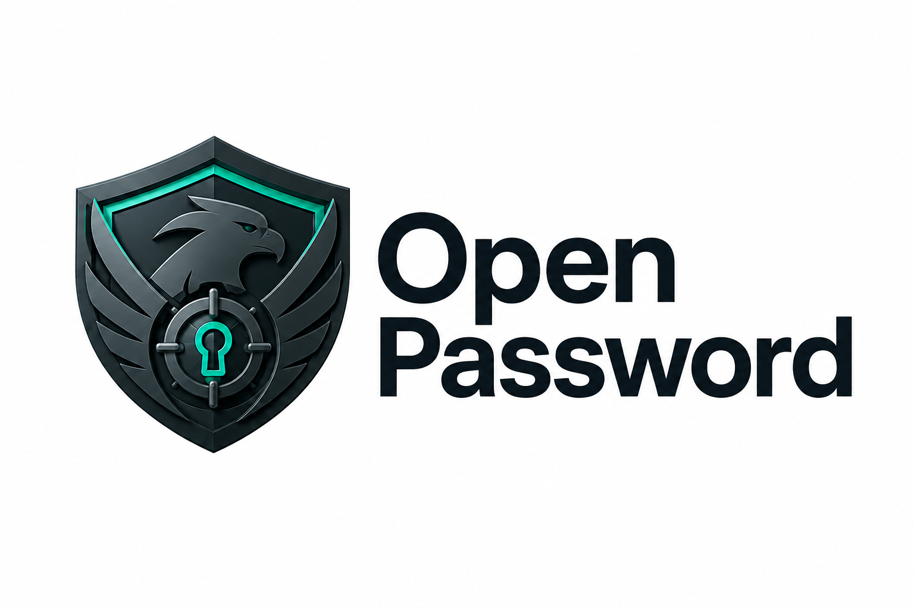

<p align="center">
  
</p>

<p align="center">
  <strong>Gestor de contraseñas mobile, open source y cero-conocimiento.</strong><br>
  Tus contraseñas se cifran en tu dispositivo — ni el servidor ni nadie puede leerlas.
</p>

<p align="center">
  
  
  
  
  
</p>

<p align="center"><em>Por JasubiP® — Marca registrada 2015–2026.</em></p>

---

## ¿Por qué Open Password?

Mucha gente sigue guardando sus contraseñas en un Excel o una nota: texto plano, fácil de
filtrar, incómodo en el móvil. **Open Password** lo reemplaza por una bóveda cifrada,
multiplataforma y cómoda, con un modelo de seguridad **cero-conocimiento** de verdad: el
servidor solo almacena texto cifrado y jamás ve tu contraseña maestra ni tus datos.

## Características

- 🔐 **Cifrado cero-conocimiento** — Argon2id (derivación) + AES-256-GCM (datos). El servidor
  solo guarda ciphertext.
- 🗂️ **Bóvedas** para separar contextos (Personal, Familia, Trabajo, Proyectos…).
- ☁️ **Sincronización** entre dispositivos con Supabase — solo se suben datos cifrados.
- 👆 **Desbloqueo biométrico** (Face ID / huella) + **auto-bloqueo** por inactividad.
- 🎲 **Generador** de contraseñas fuertes con entropía configurable (CSPRNG).
- 🔎 **Búsqueda global** y **logos de marca** en cada entrada.
- 📋 **Copia con auto-borrado** del portapapeles (30 s) y contraseñas **ocultas por defecto**.
- 🛡️ **Bloqueo de capturas** de pantalla en datos sensibles.
- 🌙 Interfaz **dark-only**, cuidada (ver [sistema de diseño](docs/design/design-system.md)).

## Capturas

<!-- TODO: agregar imágenes reales. Sugerencia de orden: Bóvedas · Detalle de bóveda · Detalle de entrada · Generador · Ajustes · Desbloqueo -->

|  Bóvedas  | Detalle de entrada | Generador | Ajustes |
|:---------:|:------------------:|:---------:|:-------:|
| _(imagen)_ |      _(imagen)_    | _(imagen)_ | _(imagen)_ |

> Las capturas se agregarán acá.

## Seguridad en 30 segundos

1. Definís una **contraseña maestra**. De ella se deriva la **Master Key** con `Argon2id`
   (el salt y los parámetros se guardan por usuario; no son secretos).
2. Una **Vault Key** AES-256 aleatoria cifra todos tus datos. Se guarda **envuelta** con la
   Master Key — el servidor nunca la ve en claro.
3. Para autenticar contra el backend se usa un **auth hash** derivado aparte (no la maestra).
4. Las claves viven **solo en RAM** mientras la sesión está abierta; opcionalmente la Vault Key
   se guarda en el Keychain/Keystore para desbloqueo biométrico.

> ⚠️ Si olvidás tu contraseña maestra, **tus datos no se pueden recuperar**. Es el precio (y el
> punto) del cero-conocimiento. Detalles en [`SECURITY.md`](SECURITY.md) y
> [ADR 0002](docs/adr/0002-cifrado-cero-conocimiento.md).

## Stack

| Capa | Tecnología |
|---|---|
| App | Expo (SDK 56) + React Native + Expo Router (TypeScript) |
| Estado | Zustand |
| Cache local | `expo-sqlite` (solo ciphertext) |
| Cripto | `@noble/hashes` (Argon2id, PBKDF2), `@noble/ciphers` (AES-256-GCM), `expo-crypto` (CSPRNG) |
| Backend | Supabase (Postgres + Auth + Row Level Security) |
| Biometría | `expo-local-authentication` + `expo-secure-store` |

Toda la cripto es **JS puro auditado** (corre en Expo Go). Para parámetros Argon2 de nivel
OWASP sin penalizar la UX hay un punto de integración para **Argon2id nativo** en builds de
producción (ver [ADR 0005](docs/adr/0005-argon2-nativo.md)).

## Empezar (desarrollo)

> Requisitos: Node LTS y la app **Expo Go** en tu teléfono (o un simulador iOS/Android).

```bash
npm install
cp .env.example .env   # completá EXPO_PUBLIC_SUPABASE_URL y _KEY
npx expo start         # escaneá el QR con Expo Go
```

Para la sincronización necesitás un proyecto Supabase con las migraciones aplicadas:

```bash
npm run check:supabase          # verifica conectividad + RLS
# aplicar migraciones: supabase db push  (o pegar supabase/migrations/*.sql en el SQL editor)
```

### Tests

```bash
npm test                # unitarios (cripto, auth, sync, generador…)
npm run test:e2e        # E2E opt-in contra el Supabase real (RUN_E2E=1)
```

## Build de producción (EAS)

La app usa [EAS Build](https://docs.expo.dev/build/introduction/). Perfiles en `eas.json`:

```bash
npm i -g eas-cli
eas login
eas init                       # crea/vincula el proyecto EAS (rellena el projectId)

eas build --profile preview --platform android      # APK interno para probar
eas build --profile production --platform all       # AAB / IPA para las tiendas
```

> El perfil `production` está pensado para habilitar **Argon2id nativo** (ADR 0005) y subir los
> parámetros del KDF. El desarrollo diario sigue en Expo Go con la cripto en JS.

## Estructura

```
src/
├── app/            # pantallas (Expo Router): (auth), (app)/(tabs), detalle, unlock
├── crypto/         # KDF, cifrado, gestión de la Vault Key (núcleo cero-conocimiento)
├── db/             # cache local SQLite (solo ciphertext)
├── lib/            # auth, sync, generador, biometría, clipboard…
├── store/          # Zustand: session, vaults, preferences
├── components/     # UI reutilizable
└── constants/      # tema, catálogo de plataformas
supabase/migrations/  # schema + RLS
docs/                 # arquitectura, ADRs, diseño
```

## Documentación

- [`docs/architecture.md`](docs/architecture.md) — diseño técnico y plan por fases.
- [`docs/adr/`](docs/adr/) — decisiones de arquitectura (cripto, sync, iconos, Argon2 nativo).
- [`docs/design/`](docs/design/) — sistema de diseño y especificación de pantallas.

## Roadmap

- [ ] Importar desde Excel (CSV).
- [ ] Argon2id nativo activado en build de producción (subir parámetros del KDF).
- [ ] Capturas y material para el repo / tiendas.

## Contribuir

¡Bienvenidas las contribuciones! Mirá [`CONTRIBUTING.md`](CONTRIBUTING.md). Las aportaciones
(branches, commits, PRs) van en **inglés** y siguen Conventional Commits.

## Licencia

Código bajo [MIT](LICENSE) — © 2026 Jasubi Piñeyro. La marca y el imagotipo **JasubiP®** son
identidad del autor y **no** están cubiertos por la licencia del código.
